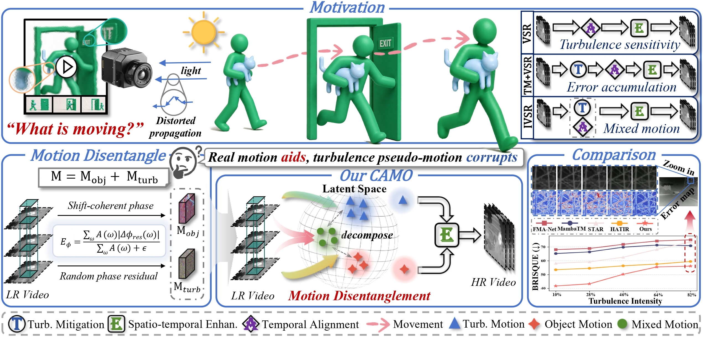
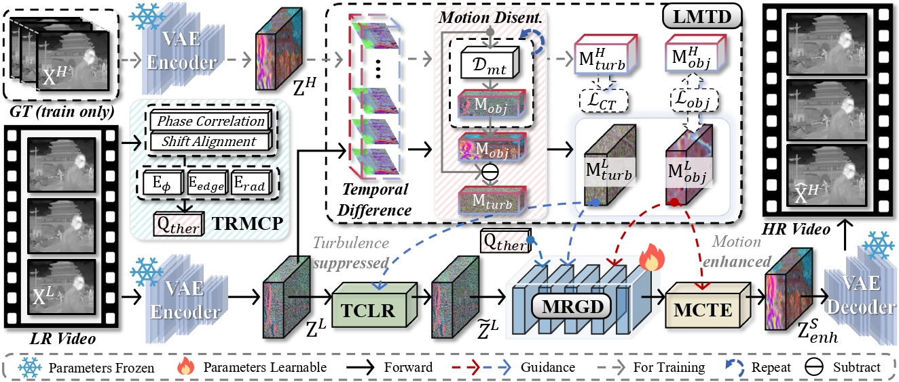
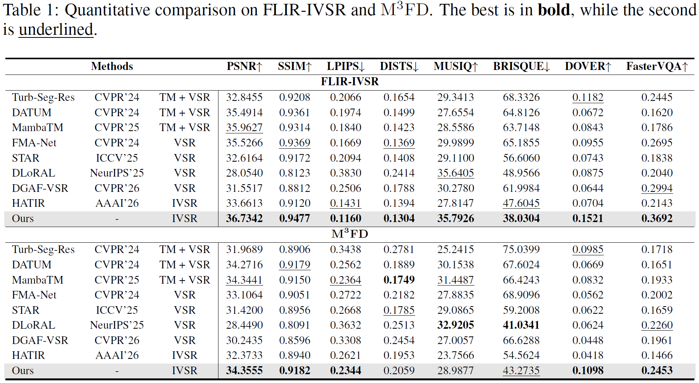
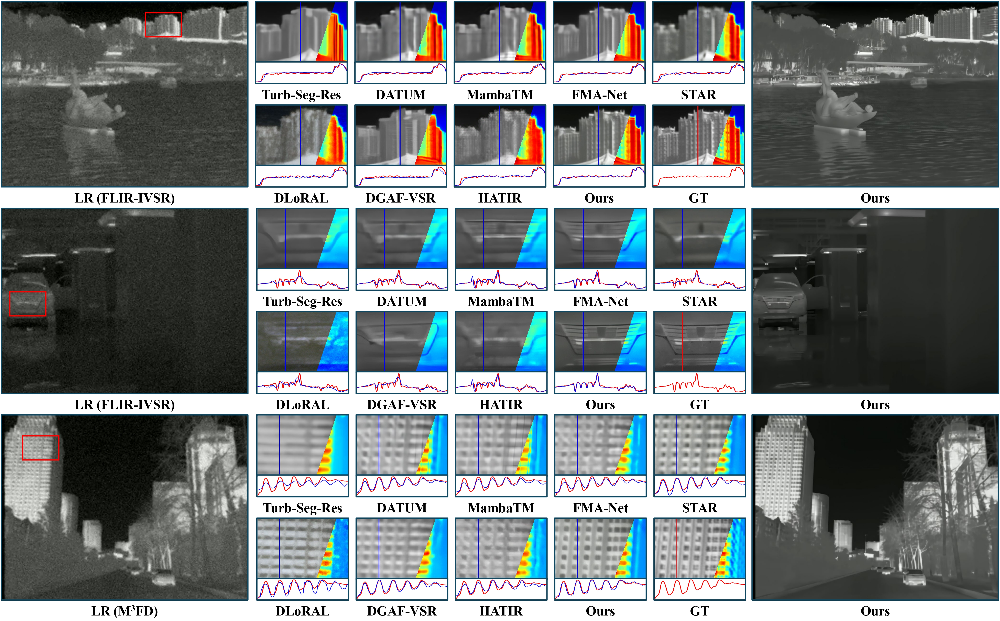
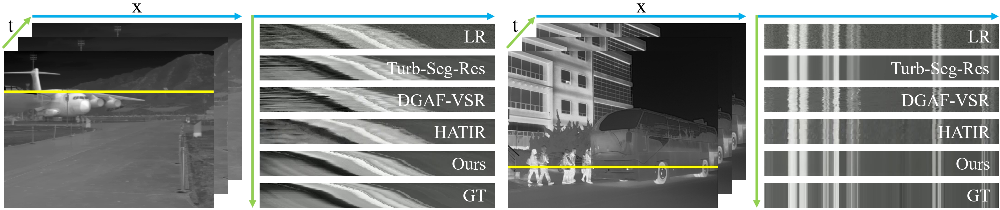

# When Motion Misleads: Causal-Role-Aware Motion-Turbulence Disentanglement for Turbulent Infrared Video Super-Resolution

This anonymous repository contains the training, inference, and evaluation code for **CAMO** (**C**ausal-role-**A**ware **M**otion-turbulence disentanglement for **O**ne-step diffusion restoration).

[Project page](https://camo23333.github.io/camo.github.io/)

<p align="center">
  
</p>

## Method

CAMO performs one-step diffusion restoration on top of CogVideoX1.5-5B. A frozen VAE encodes the turbulent LR video into latent space.

- **LMTD** factorizes mixed temporal variations into object/camera motion and turbulence components.
- **TCLR** suppresses turbulence perturbations before DiT restoration.
- **MCTE** uses object-motion cues to enhance temporal consistency after DiT restoration.
- **TRMCP** estimates turbulence strength from phase, radiative, and edge coherence.
- **MRGD** uses motion reliability to modulate DiT features and velocity prediction.

<p align="center">
  
</p>

## Installation

The tested environment is Python 3.11 and PyTorch 2.7.1 with CUDA 12.8 (including Blackwell `sm_120`). Linux, Git, and FFmpeg are required.

```bash
conda create -n camo python=3.11 -y
conda activate camo
python -m pip install --upgrade pip
pip install -r requirements.txt
```

The paper configuration uses four RTX PRO 6000 GPUs, total batch size 8, BF16, and DeepSpeed ZeRO-2.

## Resources

| Resource | Path | Source |
| --- | --- | --- |
| CogVideoX1.5-5B | `pretrained_models/CogVideoX1.5-5B/` | [Hugging Face](https://huggingface.co/zai-org/CogVideoX1.5-5B) |
| CAMO checkpoint | `pretrained_models/CAMO/` | [GitHub](https://github.com/CAMO23333/CAMO) |
| Pre-split datasets | `datasets/` | [GitHub](https://github.com/CAMO23333/CAMO) |

The CAMO checkpoint is a complete Diffusers pipeline. The dataset release contains the exact train/test data used for the paper.

## Dataset protocol

Copy the released `datasets/` directory into the repository:

```text
datasets/
├── train/FLIR-IVSR-video/{gt,turb_lr}/
└── test/
    ├── FLIR-IVSR-video/{gt,turb_lr}/
    └── M3FD-video/{gt,turb_lr}/
```

| Dataset | Training | Testing |
| --- | ---: | ---: |
| FLIR-IVSR | videos `0135`–`0644` (510) | videos `0000`–`0134` (135) |
| M3FD | — | 100 generated 30-frame videos |

M3FD testing uses 100 selected images, repeated for 30 frames, followed by turbulence distortion, downsampling, and noise. Use the released data directly for exact paper-result reproduction.

## Training

```bash
NUM_PROCESSES=4 \
MODEL_PATH=pretrained_models/CogVideoX1.5-5B \
DATA_ROOT=datasets/train/FLIR-IVSR-video \
OUTPUT_DIR=checkpoints/CAMO \
bash train.sh
```

The paper setting uses 25-frame clips at 320×640, random dropping of up to 5 frames, AdamW with learning rate `2e-5`, 10,000 iterations, and `lambda_motion=0.5`. Motion-module parameters use the code defaults.

Convert a training checkpoint to a complete Diffusers checkpoint:

```bash
python finetune/scripts/prepare_sft_ckpt.py \
    --checkpoint_dir checkpoints/CAMO/checkpoint-10000 \
    --weights_source pretrained_models/CogVideoX1.5-5B \
    --ckpt_output_dir pretrained_models/CAMO
```

## Inference

```bash
# FLIR-IVSR
MODEL_PATH=pretrained_models/CAMO \
INPUT_DIR=datasets/test/FLIR-IVSR-video/turb_lr \
OUTPUT_DIR=results/FLIR-IVSR \
GPU_ID=0 bash inference.sh

# M3FD
MODEL_PATH=pretrained_models/CAMO \
INPUT_DIR=datasets/test/M3FD-video/turb_lr \
OUTPUT_DIR=results/M3FD \
GPU_ID=0 bash inference.sh
```

Bundled examples are available under `samples/`. Inference uses seed 42 and one-step restoration; temporal/spatial tiling is available in `inference.py` for limited memory.

## Evaluation

Download DOVER and FasterVQA from their official repositories, including the required pretrained weights, and place them under `metrics/DOVER/` and `metrics/FAST-VQA-and-FasterVQA/`.

Evaluate all metrics reported in the paper in one run:

```bash
# FLIR-IVSR
PRED_DIR=results/FLIR-IVSR \
GT_DIR=datasets/test/FLIR-IVSR-video/gt \
OUTPUT_DIR=results/FLIR-IVSR/metrics \
bash evaluate.sh

# M3FD
PRED_DIR=results/M3FD \
GT_DIR=datasets/test/M3FD-video/gt \
OUTPUT_DIR=results/M3FD/metrics \
bash evaluate.sh
```

The default metrics are PSNR, SSIM, LPIPS, DISTS, MUSIQ, BRISQUE, DOVER, and FasterVQA.

## Results

<p align="center">
  
</p>

<p align="center">
  
</p>

<p align="center">
  
</p>

## License

Apache License 2.0. The base model and datasets remain subject to their respective licenses.
